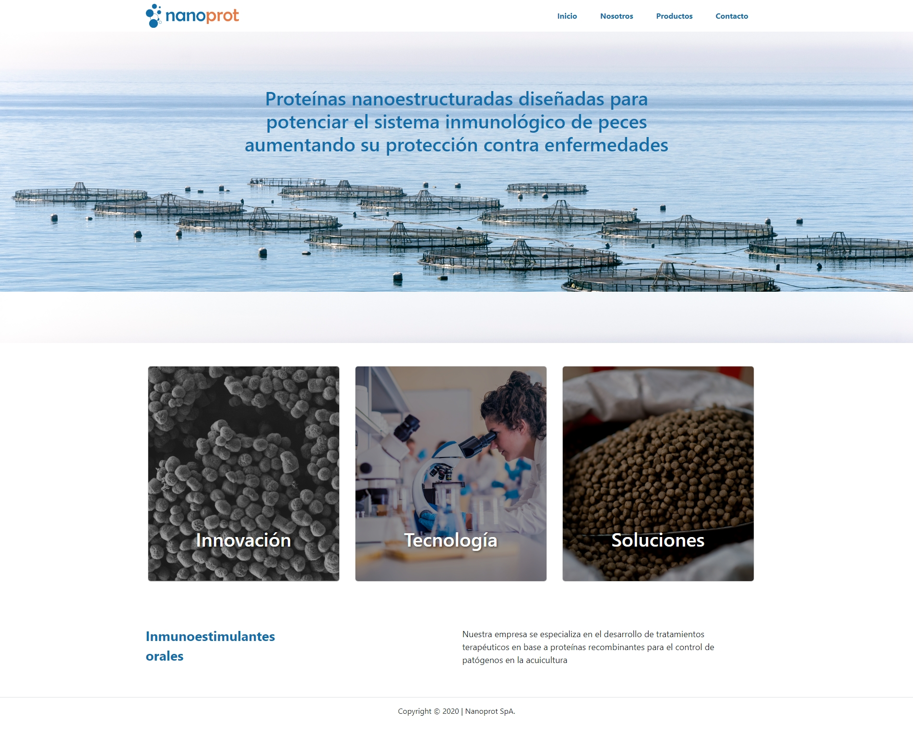

# Nanoprot SpA

## Descripción

Este proyecto es una página web para Nanoprot SpA, una empresa especializada en el desarrollo de nanotecnología para el control de patógenos en acuicultura. La página web presenta información sobre la empresa, sus productos y su tecnología innovadora.

## Vista Codificada

A continuación, se muestra la imagen del resultado codificado:

## Licencia

Este proyecto está bajo la **Apache-2.0**. Consulta el archivo LICENSE para obtener más detalles.

## Autor

Este proyecto fue desarrollado por **Valeria Torrealba**.